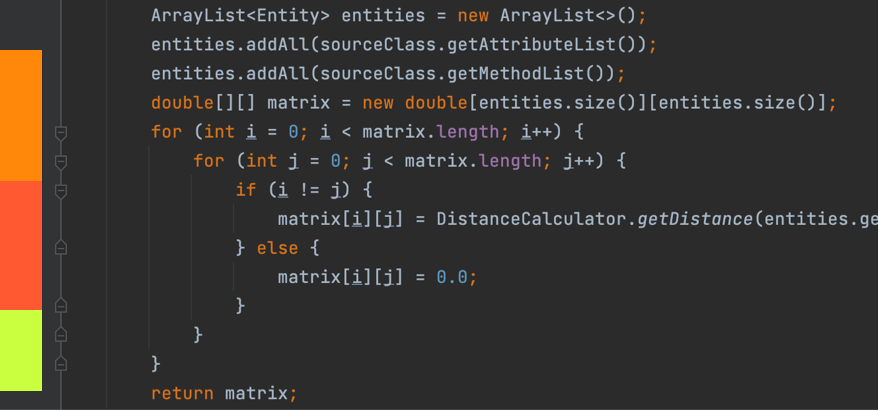
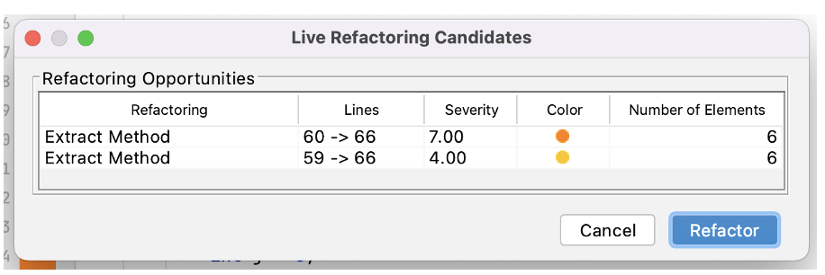

# LiveRef - a Live Refactoring Environment

We present a **Live Refactoring Environment** that helps software developers improve the quality of their software systems by identifying, suggesting, and applying several ___Extract Method___ refactorings in real-time. An ***Extract Method*** allows to extract code from a very long method into a new, simpler, and more understandable method.

This refactoring environment was developed for **Java** code on the **IntelliJ IDE**, and it focuses on analyzing specific quality attributes to detect particular code smells, such as the ___Long Method___ or ***Duplicated Code***. By identifying different smells, this environment selects and applies possible refactoring methods capable of mitigating each smell.

At the moment, the code quality metrics considered by our tool are:

| File Metrics   |      Class Metrics      |  Method Metrics |
|----------|-------------|------|
| Number of Lines of Code, Number of Comments, Number of Classes, Number of Methods, Average Number of Long Methods, Average Lack of Cohesion, Average Cyclomatic Complexity |  Number of Fields, Number of Public Fields, Number of Methods, Number of Long Methods, Class Lack of Cohesion, Average Cyclomatic Complexity | Number of Parameters, Number of Lines of Code, Number of Comments, Number of Statements, Method Lack of Cohesion, Cyclomatic Complexity, Halstead Complexity Metrics, Maintainability Degree|

 
## How to install

To use this tool, we need to install it on IntelliJ IDE by following the next steps:

1. Launch the **IntelliJ IDE**;
2. Select your IDE's preferences. There you will find the ***“Plugins”*** menu;
3. Select the option of ___“Install Plugin from Disk”___ (see the following image);
4. Search the folder where you place the **plugin distribution** and select its **.zip** folder ([LiveRef.zip](/LiveRef.zip));
5. Then, IntelliJ will install the plugin. 

 

     

## Tool in action

[Here](https://youtu.be/_jxx21ZiQ0o) you can find a demonstration video that summarizes the main actions of our tool.

1. There is a menu on the top bar called ***“Live Refactoring”***. In this menu, there are several options;
2. To start the analysis of the code open in the text editor, users need to select the option ___“Start Analysis”___;
3. After the analysis starts, the possible ***Extract Methods*** are shown in the text editor. These are painted with different colors within a range between green and red. Green represents code that doesn’t need to be immediately refactored, and red represents code with less quality that should be refactored as soon as possible;

 

      
4. By selecting a color in a given line of code, users have access to a menu called ___“Refactoring Menu”___, which shows all the ***Extract Methods*** related to that line of code. The color presented next to the code is the color of the worst refactoring found on that line. In this menu, the user can verify all the refactorings in descending order of severity and check all the lines of code associated with it;

 

     
5. Then, if users want to perform a refactoring, they need to select the respective refactoring and click on the ___“Refactor”___ button on that menu;
6. Since we are analyzing ***Extract Method*** refactorings, a new menu appears where the users have to write a name for the extracted method. Then, they need to click on the ___“Refactor”___ button;
7. After this action, the refactoring is automatically applied to the code, and the tool starts a new analysis.

## Further Information

Folder [LiveRefactoring](/LiveRefactoring) contains the source code of our ***LiveRefactoring Environment***.

Folder [Experiment](/Experiment) contains the main artifacts used by the participants of our empirical experiment and the main results collected from it.
